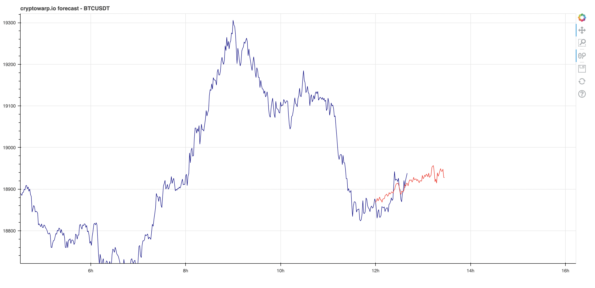
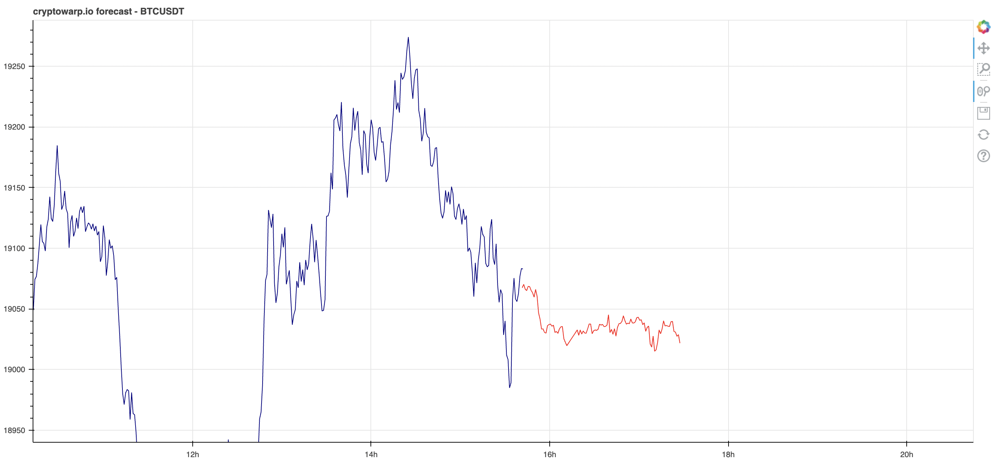
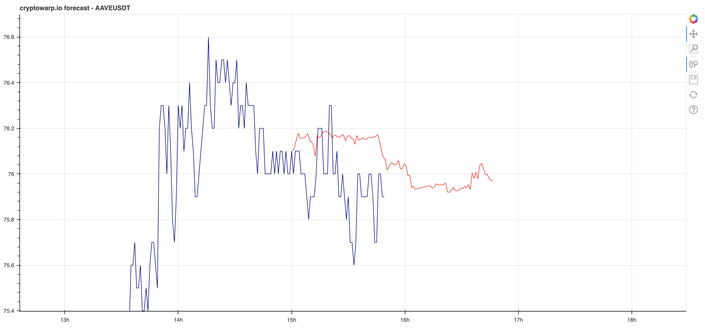

## Plot the forecasts data from cryptowarp.io with the coins historical data from binance.

Requirements:
- Python
- Bokeh
- Pandas


It should produce a plot like this:

<p align="center"></p>
<p align="center"></p>
<p align="center"></p>

### Usage

```bash
$ python plot_cryptowarp.py "BTCUSDT"
```

### Don't forget to change the API key

```python
api_key = "YOUR_API_KEY"
```
